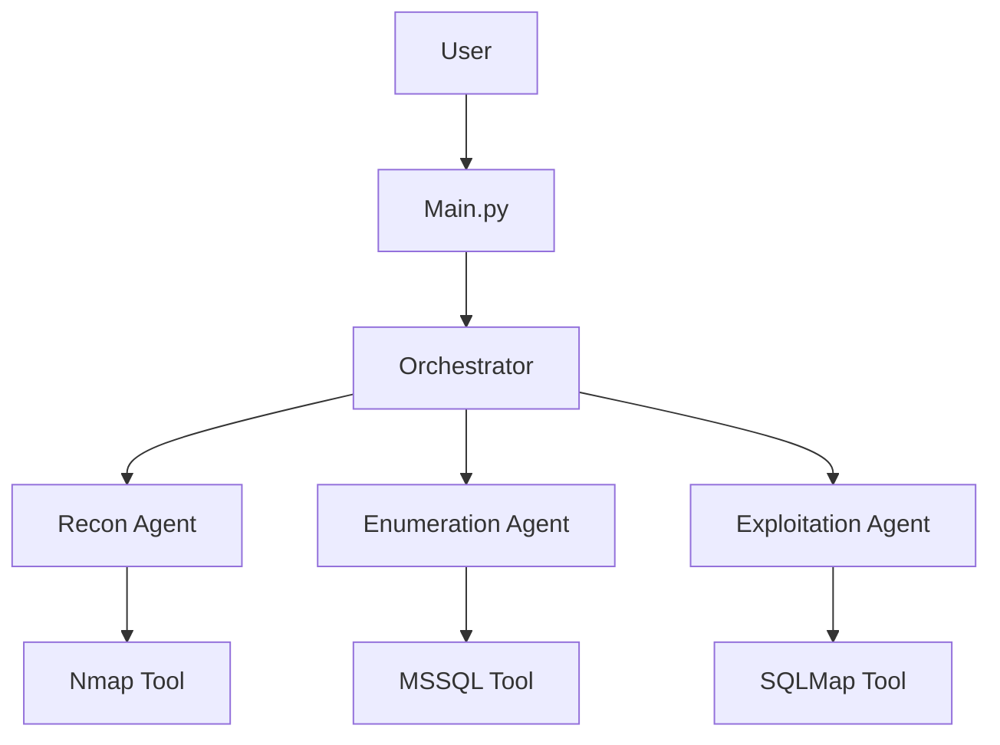

# Next Steps & Recommendations

## 📋 Summary of Completed Work

✅ **Phase 1 Complete** - Critical improvements have been implemented:
- Import error handling
- Comprehensive logging framework
- Enhanced error handling
- Type hints and documentation
- Testing infrastructure (pytest)
- Audit logging service
- Development tooling configuration

---

## 🚀 Immediate Next Steps

### 1. Install Development Dependencies
```bash
uv sync --dev
```

This will install:
- pytest (testing)
- pytest-cov (coverage)
- black (formatter)
- ruff (linter)
- mypy (type checker)

### 2. Run Initial Tests
```bash
# Run the test suite
pytest

# Check code coverage
pytest --cov=. --cov-report=html

# View coverage report
open htmlcov/index.html  # Mac/Linux
start htmlcov/index.html  # Windows
```

### 3. Format and Lint Code
```bash
# Format code
black .

# Check linting
ruff check .

# Fix auto-fixable issues
ruff check --fix .
```

### 4. Integrate Audit Logging
Update `main.py` to initialize audit logging:

```python
from services.audit_service import initialize_audit_logger

# After loading config
audit_logger = initialize_audit_logger()
audit_logger.log_event(
    AuditEventType.SCAN_START,
    f"Starting scan on {host}:{port}",
    target=host,
    user=username
)
```

---

## 🎯 Phase 2: Security Hardening (Next Priority)

### High Priority

#### 1. Credential Encryption
**Current:** Credentials stored in plain text  
**Goal:** Encrypt credentials at rest

```python
# Create services/credential_service.py
from cryptography.fernet import Fernet
import os

class CredentialManager:
    def __init__(self):
        key = os.getenv('ENCRYPTION_KEY') or Fernet.generate_key()
        self.cipher = Fernet(key)
    
    def encrypt(self, data: str) -> str:
        return self.cipher.encrypt(data.encode()).decode()
    
    def decrypt(self, encrypted: str) -> str:
        return self.cipher.decrypt(encrypted.encode()).decode()
```

#### 2. Rate Limiting
**Current:** No rate limiting on tool calls  
**Goal:** Prevent abuse and accidental DOS

```python
# Add to tools/nmap.py
from functools import wraps
import time

def rate_limit(calls_per_minute=10):
    min_interval = 60.0 / calls_per_minute
    last_called = [0.0]
    
    def decorator(func):
        @wraps(func)
        def wrapper(*args, **kwargs):
            elapsed = time.time() - last_called[0]
            if elapsed < min_interval:
                time.sleep(min_interval - elapsed)
            result = func(*args, **kwargs)
            last_called[0] = time.time()
            return result
        return wrapper
    return decorator

@rate_limit(calls_per_minute=5)
def nmap_tool(...):
    ...
```

#### 3. Enhanced Input Validation
**Current:** Basic regex validation  
**Goal:** Comprehensive validation with sanitization

```python
# Enhance services/validator_service.py
import ipaddress
from urllib.parse import urlparse

def is_valid_ip(ip: str, allow_private: bool = False) -> bool:
    try:
        ip_obj = ipaddress.ip_address(ip)
        if not allow_private and ip_obj.is_private:
            return False
        return True
    except ValueError:
        return False

def validate_sql_query(query: str) -> tuple[bool, list[str]]:
    """Validate SQL query for safety"""
    warnings = []
    
    dangerous_keywords = ['DROP', 'DELETE', 'TRUNCATE', 'ALTER']
    for keyword in dangerous_keywords:
        if keyword in query.upper():
            warnings.append(f"Dangerous keyword: {keyword}")
    
    return len(warnings) == 0, warnings
```

---

## 📊 Phase 3: Enhanced Reporting

### 1. Structured Report Generation

```python
# Create services/report_service.py
from dataclasses import dataclass
from datetime import datetime
from typing import List, Dict, Any
import json

@dataclass
class Finding:
    severity: str  # critical, high, medium, low
    title: str
    description: str
    evidence: str
    remediation: str
    cve_ids: List[str]

class ReportGenerator:
    def __init__(self, scan_id: str):
        self.scan_id = scan_id
        self.findings: List[Finding] = []
        self.start_time = datetime.now()
    
    def add_finding(self, finding: Finding):
        self.findings.append(finding)
    
    def generate_json(self) -> str:
        report = {
            "scan_id": self.scan_id,
            "timestamp": datetime.now().isoformat(),
            "duration": (datetime.now() - self.start_time).total_seconds(),
            "findings_summary": {
                "critical": sum(1 for f in self.findings if f.severity == "critical"),
                "high": sum(1 for f in self.findings if f.severity == "high"),
                "medium": sum(1 for f in self.findings if f.severity == "medium"),
                "low": sum(1 for f in self.findings if f.severity == "low"),
            },
            "findings": [vars(f) for f in self.findings]
        }
        return json.dumps(report, indent=2)
    
    def generate_html(self) -> str:
        # Generate HTML report
        ...
```

### 2. CVE Integration

```python
# Add to tools/cve_lookup.py
import requests

def lookup_cve(cve_id: str) -> Dict[str, Any]:
    """Lookup CVE details from NVD database"""
    url = f"https://services.nvd.nist.gov/rest/json/cves/2.0?cveId={cve_id}"
    response = requests.get(url)
    return response.json()
```

---

## 🔧 Phase 4: Tool Improvements

### 1. Connection Pooling for MSSQL

```python
# Enhance tools/mssql.py
from queue import Queue
from contextlib import contextmanager

class ConnectionPool:
    def __init__(self, host, port, user, password, max_size=5):
        self.pool = Queue(maxsize=max_size)
        self.config = (host, port, user, password)
        for _ in range(max_size):
            self.pool.put(self._create_connection())
    
    @contextmanager
    def get_connection(self):
        conn = self.pool.get()
        try:
            yield conn
        finally:
            self.pool.put(conn)
```

### 2. Result Caching

```python
# Add to utils/cache.py
from functools import wraps
import hashlib
import json
import time

def cache_result(ttl_seconds=300):
    cache = {}
    
    def decorator(func):
        @wraps(func)
        def wrapper(*args, **kwargs):
            # Create cache key from function args
            key = hashlib.md5(
                json.dumps((func.__name__, args, kwargs), sort_keys=True).encode()
            ).hexdigest()
            
            if key in cache:
                result, timestamp = cache[key]
                if time.time() - timestamp < ttl_seconds:
                    return result
            
            result = func(*args, **kwargs)
            cache[key] = (result, time.time())
            return result
        return wrapper
    return decorator
```

---

## 📝 Phase 5: Documentation

### 1. Generate API Documentation

```bash
# Install sphinx
pip install sphinx sphinx-rtd-theme

# Initialize docs
cd docs
sphinx-quickstart

# Generate docs
sphinx-apidoc -o source/ ../
make html
```

### 2. Architecture Diagrams

Use tools like:
- **Draw.io** for system architecture
- **PlantUML** for sequence diagrams
- **Mermaid** for flowcharts (embeddable in Markdown)

Example Mermaid diagram:


---

## 🧪 Phase 6: Continuous Integration

### Create `.github/workflows/ci.yml`

```yaml
name: CI

on: [push, pull_request]

jobs:
  test:
    runs-on: ubuntu-latest
    steps:
      - uses: actions/checkout@v3
      
      - name: Set up Python
        uses: actions/setup-python@v4
        with:
          python-version: '3.12'
      
      - name: Install dependencies
        run: |
          pip install uv
          uv sync --dev
      
      - name: Run tests
        run: pytest --cov=. --cov-report=xml
      
      - name: Upload coverage
        uses: codecov/codecov-action@v3
        with:
          file: ./coverage.xml
      
      - name: Lint with ruff
        run: ruff check .
      
      - name: Type check with mypy
        run: mypy .
```

---

## 📦 Pre-commit Hooks

### Create `.pre-commit-config.yaml`

```yaml
repos:
  - repo: https://github.com/psf/black
    rev: 24.0.0
    hooks:
      - id: black
        language_version: python3.12

  - repo: https://github.com/astral-sh/ruff-pre-commit
    rev: v0.1.0
    hooks:
      - id: ruff
        args: [--fix]

  - repo: https://github.com/pre-commit/pre-commit-hooks
    rev: v4.5.0
    hooks:
      - id: trailing-whitespace
      - id: end-of-file-fixer
      - id: check-yaml
      - id: check-added-large-files
```

Install:
```bash
pip install pre-commit
pre-commit install
```

---

## 🎯 Success Metrics

Track these metrics to measure improvement:

- **Test Coverage:** Target >80%
- **Code Quality:** Ruff score 10/10
- **Type Coverage:** MyPy >90%
- **Security:** 0 critical vulnerabilities (bandit scan)
- **Performance:** Tool execution time < baseline
- **Documentation:** 100% public API documented

---

## 🚨 Critical Reminders

1. **Never commit credentials** - Always use `.env` files
2. **Always get authorization** - Before testing any system
3. **Log everything** - Use audit logger for all operations
4. **Test before committing** - Run pytest and linters
5. **Review audit logs** - After each testing session

---

## 📞 Getting Help

If you encounter issues:

1. Check `pentest.log` for application logs
2. Check `logs/audit_*.jsonl` for audit trail
3. Run tests: `pytest -v`
4. Check errors: Review error messages carefully
5. Review documentation: README.md, DEVELOPER_GUIDE.md

---

**Status:** ✅ Foundation complete, ready for Phase 2  
**Next Action:** Install dev dependencies and run initial tests
